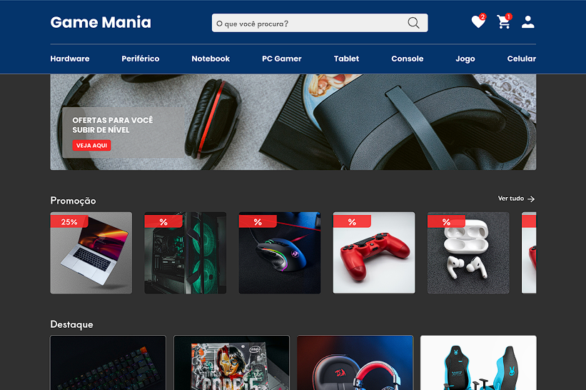

<h1 align="center"> Game Mania </h1>

Projeto desenvolvido durante o curso de qualificação programador Full Stack, promovido pelo SENAI.  

  <a href="#-tecnologias">Tecnologias</a>&nbsp;&nbsp;&nbsp;|&nbsp;&nbsp;&nbsp;
  <a href="#-projeto">Projeto</a>&nbsp;&nbsp;&nbsp;|&nbsp;&nbsp;&nbsp;
  <a href="#-layout">Layout</a>

 

  

## 🚀 Tecnologias

Esse projeto foi desenvolvido com as seguintes tecnologias:

- HTML e CSS
- JavaScript
- Git e Github
- Figma

## 💻 Projeto

Game Mania é um e-commerce de aparelhos tecnológicos voltado especialmente para o público gamer.

- [Visite o projeto online](https://gabrielmelo29.github.io/Habits)

## 🔖 Layout

Você pode visualizar o layout do projeto através [DESSE LINK](https://www.figma.com/file/P3lBhxxFu8jA4DB9jXOjIR/Game-Mania?t=Xstlw95QYQXp95Jy-1). É necessário ter conta no [Figma](https://figma.com) para acessá-lo.

---

Feito com ♥ by Gabriel Melo